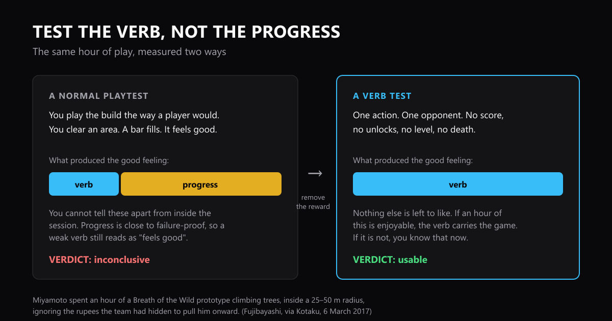

# Test the Verb, Not the Progress

Here is a test that takes an hour. It tells you something a normal playtest or demo cannot: whether the thing at the centre of your game or app is any good on its own.

You strip everything away except the one action people repeat a thousand times. In a game, that is one character and one enemy. In an app, one screen and one feature. No score, no levels, no onboarding, nothing to finish. Then you do only that, for an hour, and you watch for the moment your hand relaxes.

The map from games to apps is close to one for one. **One enemy is one feature.** You fight the enemy over and over until the fight feels right, then you move on to the next one. You use the feature over and over until it feels right, then you move on to the next one.

The word for "feels right" is where the two split. In a game you are chasing **perfect feel**: the timing lands, the hit connects, the dodge is fair. In an app you are chasing **polished**, and that word is vague, so here is what it means. A feature is polished when it does what you expected the first time you tried it, when you never wait on it, when you do not have to stop and work out how to use it, and when doing it the fortieth time is no more annoying than the first. If any of those four is missing, the feature is not done, and no amount of design around it will fix that.

## Why you need it: progress hides a bad verb

Look at what a progress structure actually is. A number that goes up. A bar that fills. A door that opens because you did enough of something. These feel good almost no matter what you did to earn them. That is why we build them. They are reliable.

That reliability is the problem when you are trying to judge your own work.

Test the normal way and the progress is doing most of the work. It supplies the good feeling, and the action gets the credit. Everyone in the room agrees it felt good, and nobody can tell you how much was the action and how much was the bar. Then it ships, and the people who did not care about your bar leave in ninety seconds.

Take the progress away and there is nothing else to like. That is the whole trick. If an hour of the bare action is pleasant, that action can carry a sixty hour game, or an app someone opens every day. If it is not, more content will not save it, and you found that out at prototype cost instead of at launch.

## In a game: one character, one enemy

The test is a build you would never ship. One player character. One enemy. No score, no upgrades, no levels, no death. He attacks, you answer, he gets back up, and you go again.

Compare what you learn.

**From a normal playtest:** solid, combat feels decent, the tally screen is satisfying, second area drags a bit. You cannot act on any of that. Did the combat feel decent, or did clearing the area feel decent? Does the second area really drag, or has the action stopped being fun and you are blaming the level for it?

**From a verb test:** the dodge window is too tight. The telegraph is so long that you commit early and get punished for reacting like a human. The counter is satisfying the first thirty times and boring by the hundredth.

Those are three things you can fix on Monday. When I built this for a brawler of my own it found two real problems in a week. The counter window could not physically close in a one on one fight, and the telegraph ran at nearly twice human reaction time. Both had been in the game for months and I had played them hundreds of times without seeing either, because there was always another wave to clear.

The rule for adding the second enemy is worth stealing too. In Super Mario Bros. the Koopa Troopa was the only basic enemy for most of development, and testers found it too tricky to open with. So the Goomba was built last and put first: an enemy invented purely to teach the stomp. The Koopa then asks a different question, because its shell tells you this one will not squash. **Each enemy asks a new question about the same action.** More health and faster timings is a difficulty slider, not an enemy.

## In an app: the user is the player character

Same test. Here is the full map.

| In a game | In your app |
|---|---|
| The player character | The user |
| The verb | The one action a feature is made of |
| One enemy | One feature |
| Perfect feel | Polished: expected, fast, obvious, still fine on the fortieth go |
| Waves, levels, districts | The rest of the product |
| The boss | The flagship feature everything builds toward |
| Score, unlocks, the bar filling | Onboarding, the demo happy path, the checklist, the roadmap |

Your demo is a progress structure. It has a story, a happy path and an ending, and it will feel fine in front of a room of people even when the thing at the centre is poor. So build the app version of one character and one enemy: **one screen, one feature, real data, nothing to finish.** Then watch one person do that feature's most repeated action forty times with no goal attached. Not a scripted walkthrough. Just the action.

If it is only bearable because it gets them closer to finishing a task, you have built a chore with good signposting, and every feature you stack on top inherits that. If they do it forty times and keep going, that feature can carry the product.

This is also the honest version of dogfooding. Using your own app to get work done tests the progress. Using the one screen you built forty times in a row tests the action.

Then work through your features the way a game works through its enemies. **One feature at a time, polished until it stands on its own, before the next one gets built.** Start with the feature that asks the core question most plainly, which is usually the simplest one rather than the flashiest. Give every feature after it a different question to ask, because a second feature that is the first one with more options is a settings screen. Put two in front of a user together before you add a third, because two features that are clear on their own and confusing side by side is a real failure, and you want to know which one caused it.

The flagship feature is the boss. Build it out of questions the user already learned to answer.

## How to run a verb test

1. **Name the action in one sentence.** One action. If it takes two sentences you have named a system, and you need to go smaller.
2. **Strip the progress.** No score, no unlocks, no levels, nothing to complete. In a game that is one enemy and a reset. In an app it is one screen and no task.
3. **Keep the real numbers and the real data.** A test on made-up values tunes something that is not your product.
4. **Instrument it.** You are turning a feeling into a number. Put every value you might change on a key, show it on screen, and give yourself a way to print the current settings the moment something feels right.
5. **Do it for an hour** and notice when your hand relaxes.
6. **Say the verdict out loud before you add anything else.** The action is good, or it is not.

One warning. Doing this to a finished project is unpleasant. You strip out systems you spent months on, and there is a real chance the answer comes back as "the core is thin". Do it before the next feature push rather than after, because the alternative is paying to build more of something that was not working.

## Where this comes from: an hour in the trees

In March 2017, Breath of the Wild director Hidemaro Fujibayashi told Jason Schreier at Kotaku how his team first pitched their open world inside Nintendo. They built a small prototype to prove you could do anything in it: a starting field with a handful of trees, and rupees hidden in the exact spots they guessed their two most important playtesters would head for.

Then they handed the controller to Shigeru Miyamoto.

> "When we first presented this to Mr. Miyamoto, he spent about an hour just climbing trees."

Then comes the detail that turns a funny story into a method. Miyamoto stayed inside a radius of roughly 25 to 50 metres. The rupees were right there, placed by people who wanted him to go and see the world. He ignored every one of them and spent the hour on the climb. He was not being odd. He was taking away the thing that would have muddied the answer.

He has always worked this way. Twenty-one years earlier, before Super Mario 64 had a single course, it had a test room made of lego-like blocks where Mario could run, climb slopes and jump. Miyamoto says half the project's time and energy went into that basic system, and the courses and enemies arrived at the very end. In 2025, the director of Donkey Kong Bananza said Miyamoto checked their build by ignoring the game and staying in one spot, smashing and digging.

Three teams, three consoles, twenty-nine years, one habit.

## Why isolating one piece works

Isolating one part of a task and drilling it is not a Nintendo invention. It is called part-task training. Wightman and Lintern reviewed the research in 1985. They define it as practising some pieces of a task before you attempt the whole thing, and in four studies where the task was split into parts, the isolated version beat whole-task practice in three of them.

*Wightman, D. C., and Lintern, G. (1985). Part-task training for tracking and manual control. Human Factors, 27(3), 267 to 283. DOI 10.1177/001872088502700304*

When you take away everything except the piece you care about, the feedback you get is about that piece. That is all Miyamoto is doing in the trees.

## Cheat sheet: the two tests side by side

| | Progress test (the default) | Verb test |
|---|---|---|
| **What you do** | Play or use it normally | One action, on repeat |
| **What is present** | Levels, score, onboarding, goals | Nothing but the action |
| **What it measures** | Everything at once | The action alone |
| **Can it fail?** | Rarely, progress props it up | Yes, and quickly |
| **In a game** | A full run | One character, one enemy |
| **In an app** | The demo | One screen, one feature |
| **You are looking for** | "Did they get to the end?" | Perfect feel, or polished |
| **The tell** | "That felt good" | "I did not want to stop" |

## The one habit to keep

Before you judge whether something is good, take away the part of it that was always going to feel good. What is left is the thing you are actually shipping.

An hour in the trees, with the rupees left on the ground.

## A question for you

What is something you would defend as genuinely good where the action itself is honestly dull, and everything around it is doing the work? I can think of a couple, and they make me less sure of my own argument, which is why I want to hear yours.

---

*Sources: the Breath of the Wild account is Hidemaro Fujibayashi speaking to Jason Schreier, Kotaku, 6 March 2017. Miyamoto's Super Mario 64 comments come from the 1996 developer roundtable printed in the Japanese strategy guide, translated at shmuplations.com/mario64. The Donkey Kong Bananza account is Kenta Motokura speaking to The Guardian, July 2025.*
